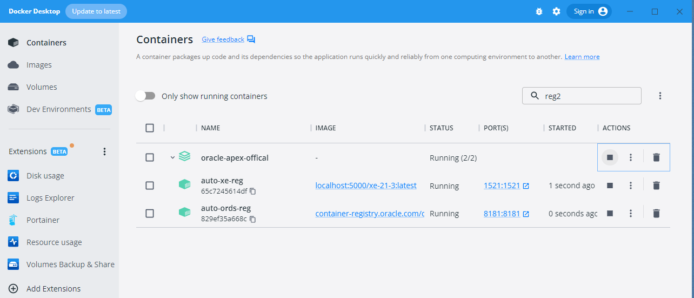
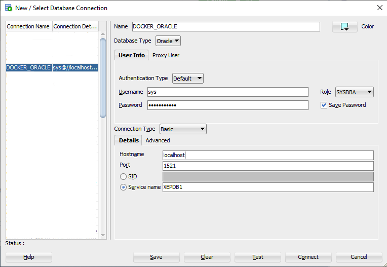

# Oracle APEX Docker Stack
### Deploy a complete Oracle database & APEX stack on Docker using Docker Compose. 

## Overview: 


## Table of Contents
1. **[Prerequisites](#Prerequisites)**
2. **[Version Info](#version-info)**
3. **[How to Install](#how-to-install)**
4. **[Connecting to the Database ](#connecting-to-the-database )**
5. **[Optional Settings](#optional-settings)**
6. **[Docker Terms](#docker-terms)**
***
# Prerequisites
- Have Docker Installed
- <mark>Create an account & test login to Oracle Image Registry</mark>
  - [Oracle Image/Container Registry](https://container-registry.oracle.com/ords/f?p=113:10)
### In a command(cmd) window, Log into Oracle Registry
```
docker login container-registry.oracle.com
```
### Pull the latest ORDS Images from the Oracle Registry
```
docker pull container-registry.oracle.com/database/ords:latest
```
### Pull the Regular Oracle XE Image from Docker Hub by gvenzl
```
docker pull gvenzl/oracle-xe
```
## Version Info
Note: Its best to review details on Oracle container registry website, but pulling latest images as of (11-22-2022) from oracle will have the following versions:

APEX Environment | ORDS | Oracle Database
 --- | --- | --- |
APEX 22.1.0 |  ORDS 22.3.1  | Oracle Database XE Release 21c (21.3.0.0)

---
## How to Install 
## Step 1: Download and/or Clone this Git Repo
### Directory Structure:
```
oracle-apex-custom
  ---- docker-compose.yml
  ---- db_init_scripts
  ---- ords_init_scripts
  ---- ords_secrets
      ---- conn_string.txt
```
### Step 2: Update the "conn_string.txt" with variables as you see fit
```
CONN_STRING=sys/PASSWORDHERE@database:1521/XEPDB1
```
Note: The conn_string.txt file will be deleted when the container starts. The database connection details are not held in environment variables in the container.
### Step 3: In a text editor, update "docker-compose.yml" with password set in "conn_string.txt" file & other variables
```
services:
  auto-xe-reg:
    container_name: auto-xe-reg
    image: gvenzl/oracle-xe
    ports: 
      - 1521:1521
    environment:
      - ORACLE_PASSWORD=PLACEPASSWORDHERE
    volumes:
      - db-vol-reg:/opt/oracle/oradata
      - ./db_init_scripts:/container-entrypoint-initdb.d
    hostname: database
    healthcheck:
      test: ["CMD", "healthcheck.sh"]
      interval: 30s
      timeout: 10s
      retries: 100
  auto-ords-reg:
    container_name: auto-ords-reg
    restart: always
    depends_on:
      auto-xe-reg:
        condition: service_healthy
    volumes:
      - ./ords_secrets:/opt/oracle/variables
      - ./ords_init_scripts:/ords-entrypoint.d/
      - ords-config-reg:/etc/ords/config
    ports:
      - 8181:8181
    image: container-registry.oracle.com/database/ords:latest
volumes:
  db-vol-reg:
    name: db-vol-reg
    external: false
  ords-config-reg:
    name: ords-config-reg
networks:
  default:
    name: ords-database-network
```
### Optional Step(DB or ORDS initalization Scripts on Install):
Place any DB or ORDS initalization scripts in their corrisponding folder: 
```
  ---- db_init_scripts
  ---- ords_init_scripts
```
See the following for full details on DB details: https://github.com/gvenzl/oci-oracle-xe#initialization-scripts
```
"The *.sql, *.sql.gz and *.sql.zip files will be executed in SQL*Plus as the SYS user connected to the Oracle instance (XE). This allows users to modify instance parameters, create new pluggable databases, tablespaces, users and more as part of their initialization scripts. If you want to initialize your application schema, you first have to connect to that schema inside your initialization script! Compressed files will be uncompressed on the fly, allowing for e.g. bigger data loading scripts to save space."
```
### Step 4: In CMD, navigate to the folder with the updated "docker-compose.yml" file (note replace path with your path)
```
cd/

cd C:\Users\FIRSTNAME.LASTNAME\Desktop\esd-oracle-apex-docker-stack\oracle-apex-custom
```
### Step 5: Run Docker Compose File
```
docker compose up
```
## And Done. Creating of the stack happens automatically 
### First time setup may take a few moments 


## Connecting to the Database 
## Connecting to the Database Within the Container
```
docker exec -it auto-xe-reg sqlplus / as sysdba
docker exec -it auto-xe-reg sqlplus sys/<your_password>@XE as sysdba
docker exec -it auto-xe-reg sqlplus system/<your_password>@XE
docker exec -it auto-xe-reg sqlplus pdbadmin/<your_password>@XEPDB1
```
## Connecting to the Database Outside of the container using SQL*Plus:
```
sqlplus sys/<your password>@//localhost:1521/XE as sysdba
```
## Connecting to the Database via SQL Dev:


---
# Optional Settings
### Reuse Existing Database or Mount Database & ORDS containers to host directory folders for database/file persistence
In the "docker-compose.yml" file, replace volumes with a directory path.

repalce:
```
    volumes:
      - db-vol-reg:/opt/oracle/oradata
```
with
```
    volumes:
      - <writable_directory_path>:/opt/oracle/oradata
```
example:
```
    volumes:
      - C:\Oracle\opt\oracle\oradata:/opt/oracle/oradata
```

### Configure & Change ORDS Container default config options
For ords 22.2 java ords.war deprecated
- https://www.oracle.com/tools/ords/ords-relnotes-222.html
- https://oracle-base.com/articles/misc/oracle-rest-data-services-ords-standalone-mode-22-onward

View current commands:
- ords config info

Examples:
- ords config set jdbc.MinLimit 5
- ords config set jdbc.MaxLimit 30
- ords config set jdbc.InitialLimit 15
- ords config set jdbc.MaxStatementsLimit 20
- ords config set jdbc.InactivityTimeout 3600
- ords config set jdbc.statementTimeout 1800
- ords config set jdbc.MaxConnectionReuseCount 2000
---

## Docker Terms
Docker:
  - Platform for creating and running containers

Docker Compose File:
  - tool for deining and running multi-container docker stack/apps
  - get app running in one command
  - Can be used in a Continuous Integration and Continuous Deployment (CI/CD) Pipeline

Docker file(can be used or ran via command line)
  - Build instructions for an image

Docker image
  - Made with build command
  - Read only
  - Source code. Template with all files needed to make container

Docker container: 
  - Made with run command
  - read-write
  - An instance of an image. 
  - Can have multiple containers to one image.
  - Can be saved as a new image like a snapshot

Docker volume
  - Storage for persistent data generated by docker container
  - Other option is to mount to filesystem directly 
